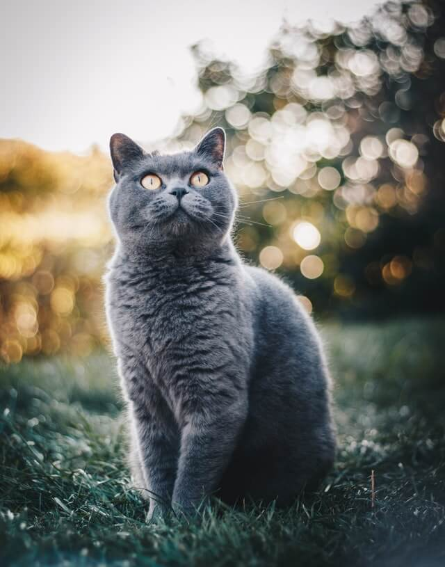

# HTML and CSS everywhere...

A responsive html page using css, flex, bulmacss

#### For debug css use

- Comment or uncomment `debug.css` file
- Alternatively use [X-ray](https://tachyons.io/xray/) plugin for Chrome

## Buenas practicas HTML

### Añadir la estructura básica necesaria dentro de head

```html
<html lang="en">
  <head>
    <meta charset="UTF-8" />
    <meta name="description" content="Blog sobre perros" />
    <meta name="robots" content="index,follow" />
    <meta name="viewport" content="width=device-width, initial-scale=1.0" />
  </head>
</html>
```

- Utilizar la etiqueta figure cuando se trabaje con imágenes, si se necesita una descripción usar figcaption

### Formularios

Select con buscador

```html
<input list="cursos" />
<datalist id="cursos">
  <option value="JavaScript"></option>
  <option value="HTML5"></option>
</datalist>
```

### Uso de imagenes (loseless vs lossy) sin perdida y con perdida

- JPG `lossy` (fotografias e imágenes fijas)
- PNG 8 `lossless` (iconos, con transparencia y sin animación)
- GIF `lossless` (animaciones simples y gráficos con colores planos)
- Vectores `lossless` (imágenes fijas, pantallas de alta resolución, ideal para gráficos y logotipos en la web)

NOTA: El tamaño promedio de una imágen debe de ser de 70kb, para ello hay herramientas que las optimizan:

- Descargar imagenes en diferentes tamaños
  - [Pexels 👈](https://www.pexels.com/)
- Optimizar y mejorar el tamaño de la imágenes
  - [TinyPNG 👈](https://tinypng.com/)
- Retirar metadatos de las imágenes para reducir tamaño
  - [Verefix 👈](https://www.verexif.com/)

### CSS

- Utilizar el patrón BEM
- Utilizar CSS orientado a objetos
- No utilizar IDs para poner estilos
- Evitar utilizar `!important`
- Evitar estilos enbebidos
- Setear los estilos del navegador
- Conocer el tema de las especificidad de los selectores
  - `!important`
  - Código embebido
  - Ids
  - Clases
  - Tags
- Orden correcto de declaración de CSS: Importancia, especificidad y orden de las fuentes

> NOTA: Los selectores combinados tienen mayor peso, por ejemplo dos clases en un mismo elemento sobreescriben a una clase con una etiqueta html

### CSS Combinadores

`Hermano asdyacente o cercano:` Todas las etiquetas de parrafo cerca de una etiqueta h2 (adjacent sibling)

```CSS
h2 + p {
  color: red;
}
```

`Hermano general:` Todas las etiquetas de parrafo al mismo nivel de h2

```CSS
h2 ~ p {
  color: red;
}
```

`Hijo:` La etiqueta parrafo que sea hija directa de la etiqueta div

```CSS
div > p {
  color: red;
}
```

`Descendiente:` Todas las etiquetas de parrafo que esten dentro de una etiqueta div

```CSS
div p {
  color: red;
}
```

> Pseudo clases

Ddefinen el estilo de un estado especial de un elemento

> Pseudo elementos

Definen el estilo de una parte especifica de un elemento

### Trick medidas REM

Utilizar `rem` en lugar de `px` o `em`, para ello hay que establecer un valor predeterminado en la etiqueta raíz, de esa forma `1.6rem` serían equivalentes a `16px` y se podría manejar todo con valores rem

```CSS
* {
  box-sizing: border-box;
  margin: 0;
  padding: 0;
}

html  {
  font-size: 62.5%;
}

p {
  font-size: 1.6rem;
}
```

### Posiciones

> Static

- Posiciòn por default
- No es posible utilizar `top`, `right`, `left`, `button`

### Variables

Se declaran dentro de root

```CSS
/* definición */
:root {
  --primary-color: #003376;
  --secundary-color: #003376;
}

/* llamada */
header: {
  background-color: var(--primary-color);
}
```

### Fuentes

- Para mejorar el performance, importar las fuentes destro de la etiqueta `head`, evitar hacerlo dentro del archivo CSS dedicado
- Solo cargar una fuente por proyecto

### Patrones de maquetación Responsive Design

(MyDevice.io 👈)[https://www.mydevice.io/]

- Mostly Fluid
- Layout shifter
- Column drop

### Mobile first / Only

- breakpoint

```CSS
@media (min-width: 600px) {
  ...
}
```

- Es buena practica crear un archivo de `css` dedicado para estilos base (mobile), tableta o desktop

```HTML
<link rel="stylesheet" href="./css/mostly-fluid.css">
<link rel="stylesheet" href="./css/mostly-fluid-tablet.css" media="screen and (min-width: 600px)">
<link rel="stylesheet" href="./css/mostly-fluid-desktop.css" media="screen and (min-width: 800px)">
```

### Imagenes responsivas

- Utilizar html semantico, con la etiqueta `picture`
- Cargar imagenes diferentes dependiendo de la resución, con los media queries
- Utilizar la propiedad `width` con 100% siempre que se quiera redimensionar la imágen al tamaño de su contenedor padre

```HTML
<section>
  <picture>
    <source srcset="./images/cat-big.jpg" media="(min-width:1200px)">
    <source srcset="./images/cat-medium.jpg" media="(min-width:800px)">
    
  </picture>
</section>
```

```CSS
.cat {
  width: 100%;
}
```

[Resumen definitivo 👈](https://www.notion.so/Curso-definitivo-de-HTML-y-CSS-7196d473c6b046d2b8de4a0edaa82dc6)
